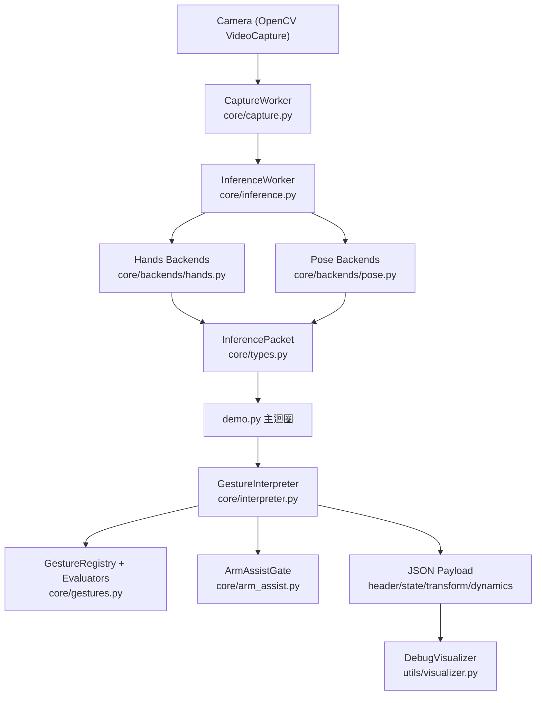
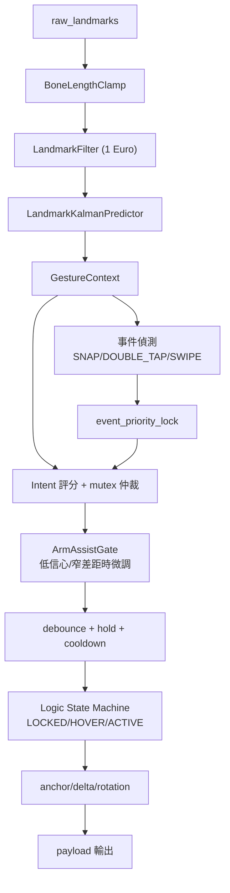
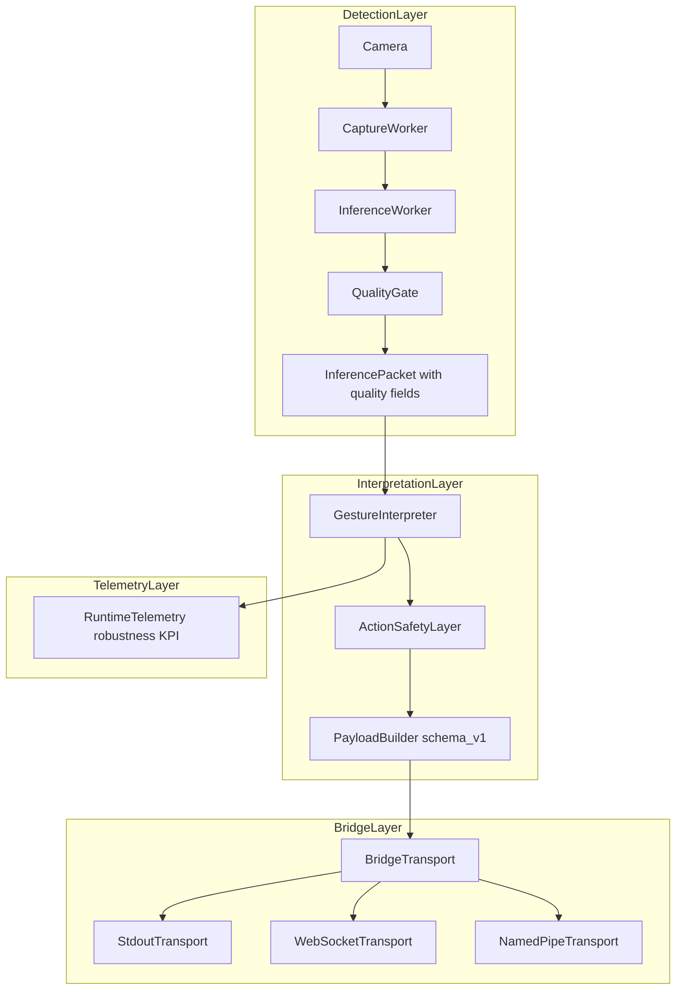

# visHand 現行架構與判斷流程說明

本文件描述目前重構後的主要模組、資料流，以及手勢判斷的核心邏輯。

## 1) 高層架構總覽

## 2) Detector Pipeline（偵測管線）

`HandDetector` 現在是 façade（`core/detector.py`），主要負責組裝：

- `CaptureWorker`：持續擷取鏡頭 frame，維護最新 `FramePacket`。
- `InferenceWorker`：讀取最新 frame，執行推論與封包輸出。

`InferenceWorker` 的主要流程如下：

1. 取得最新 frame，略過重複 frame id。
2. 根據 runtime hint 判斷是否啟用 adaptive skipping。
3. 若有 tracking anchor，嘗試 ROI 裁切 + letterbox。
4. 呼叫 Hands backend 推論（Tasks/Legacy）。
5. ROI 低信心時 fallback 回全圖推論。
6. 估算前臂特徵（Pose backend）。
7. adaptive max-hands probe（從單手動態升降雙手）。
8. 發佈 `InferencePacket`（含 `mp_ms`, `pose_ms`, `mode`, `arm_features`）。

## 3) Interpreter Pipeline（判斷邏輯管線）

重點機制：

- 幾何前處理：`Clamp -> Filter -> Predict`
- 事件優先：事件發生時短暫鎖住 intent 切換
- 手勢仲裁：每個 `mutex_group` 只保留最高分候選
- 前臂輔助：僅在低信心或 top2 窄差距時介入
- 狀態機：`LOCKED -> HOVER -> ACTIVE`，並可回退

## 4) 模組責任分工

- `core/types.py`：共用資料結構（封包與 landmark 型別）
- `core/protocols.py`：backend protocol（介面契約）
- `core/backends/*`：Hands/Pose 推論實作與建構
- `core/capture.py`：相機擷取
- `core/inference.py`：推論流程、ROI、skip、adaptive hand probing
- `core/interpreter.py`：手勢決策主引擎
- `core/arm_assist.py`：前臂輔助決策
- `core/gestures.py`：手勢規則與 evaluator registry
- `config/settings.py`：所有可調參數
- `config/calibration_profile.py`：個人化校正檔載入與套用

## 5) Bridge 與魯棒性強化（v1）

本階段新增三條橫向能力：

- `QualityGate`：輸入品質估計，提供 `input_quality_score` 與 `tracking_quality`
- `ActionSafetyLayer`：低品質場景降級高風險手勢，並提供 `EMERGENCY_CANCEL` 觸發
- `BridgeTransport`：輸出傳輸抽象（stdout/ws/pipe）

### 對外契約文件

- 對外 payload 契約（唯一來源）：`bridge/INTEGRATION_CONTRACT.md`
- Bridge 模組說明：`bridge/README.md`

### KPI 指標（`utils/profiler.py`）

- `false_event_rate`
- `intent_switch_rate`
- `avg_reacquire_time_ms`
- `quality_degraded_ratio`

## 6) 文件分工（避免重複）

- `README.md`：專案入口與文件導覽
- `ARCHITECTURE_FLOW.md`：內部架構、模組邊界、資料流
- `bridge/INTEGRATION_CONTRACT.md`：外部整合契約（schema/相容規則）
- `CHANGELOG.md`：歷史變更與里程碑

